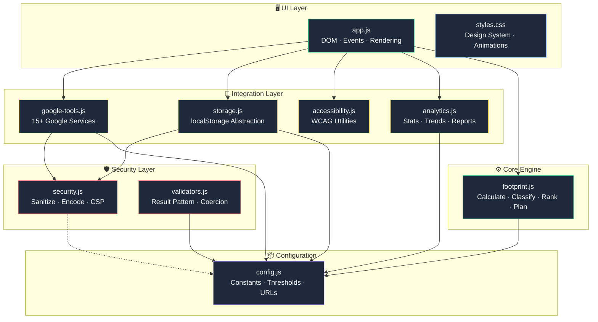
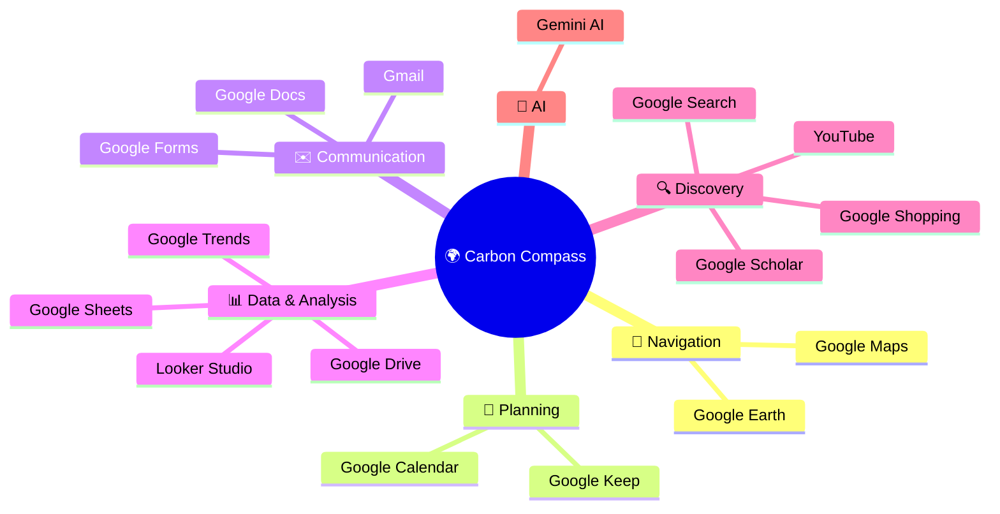
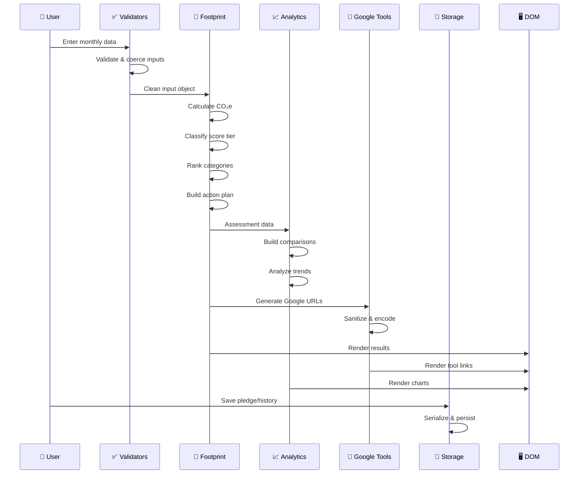
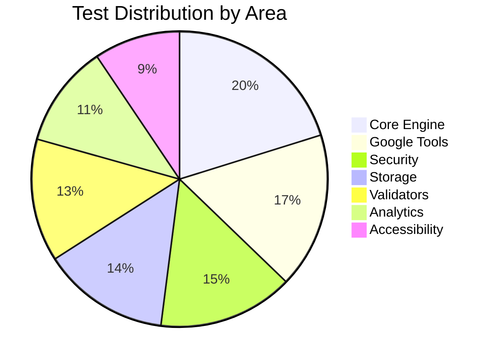

<p align="center">
  
</p>

<h1 align="center">🌍 Carbon Compass</h1>

<p align="center">
  <strong>AI-Powered Carbon Footprint Awareness Platform</strong><br/>
  <em>Understand · Track · Reduce — with Google Tools</em>
</p>

<p align="center">
  
  
  
  
  
  
</p>

<p align="center">
  
  
  
</p>

---

## 📋 Table of Contents

<details>
<summary>Click to expand</summary>

- [Overview](#-overview)
- [Challenge Vertical](#-chosen-vertical)
- [Decision Engine](#-decision-engine--approach)
- [Architecture](#-architecture)
- [Google Tool Integrations](#-google-tool-integrations-15)
- [Features](#-features)
- [Data Flow](#-data-flow)
- [Evaluation Focus Areas](#-evaluation-focus-areas)
- [Module Map](#-module-map)
- [Testing](#-testing-213-tests)
- [Security](#-security)
- [Accessibility](#-accessibility-wcag-21-aa)
- [Getting Started](#-getting-started)
- [Emission Factors](#-emission-factors)
- [Assumptions](#-assumptions)
- [License](#-license)

</details>

---

## 🌱 Overview

**Carbon Compass** is a smart, dynamic carbon footprint awareness assistant that helps individuals understand their monthly CO₂e emissions, identify their highest-impact category, and take practical action using **15+ integrated Google tools**.

```
╔══════════════════════════════════════════════════════════════════╗
║                                                                  ║
║   📊 Real-time Carbon Calculator    →  4 emission categories     ║
║   🤖 AI-Powered Action Plans       →  context-aware coaching     ║
║   🔧 15+ Google Tool Integrations  →  immediate real-world action║
║   📈 Interactive Visualizations    →  donut charts & breakdowns  ║
║   🌱 Pledge & History Tracking    →  longitudinal progress       ║
║   ♿ WCAG 2.1 AA Compliant        →  inclusive design            ║
║   🛡️ Defense-in-Depth Security    →  XSS, CSV injection safe    ║
║   🧪 213 Unit Tests               →  7 test suites              ║
║                                                                  ║
╚══════════════════════════════════════════════════════════════════╝
```

---

## 🎯 Chosen Vertical

> **Climate & Sustainability Assistant** — A persona-driven assistant that provides contextual carbon footprint estimation, logical decision-making based on user context, and practical real-world usability through Google tool integrations.

| Criteria | How Carbon Compass Delivers |
|----------|---------------------------|
| **Smart & Dynamic** | Adapts recommendations based on commute mode, goals, and top emission category |
| **Logical Decision Making** | Three-tier scoring → category ranking → context-aware action plans |
| **User Context** | Personalizes outputs using household size, commute mode, and sustainability goals |
| **Practical Usability** | One-click Google tool integrations for immediate real-world action |
| **Clean & Maintainable** | 9 dedicated modules, pure functions, JSDoc, zero dependencies |

---

## 🧠 Decision Engine & Approach

The assistant follows a **7-step decision pipeline** that transforms raw user input into personalized, actionable sustainability plans:

```mermaid
flowchart LR
    A["📝 Input\n4 Categories"] --> B["🔢 Calculate\nEPA/DEFRA Factors"]
    B --> C["🏆 Classify\n3-Tier Scoring"]
    C --> D["📊 Rank\nTop Category"]
    D --> E["🤖 Recommend\nContext-Aware Plan"]
    E --> F["🔧 Integrate\nGoogle Tools"]
    F --> G["💾 Track\nPledge & History"]

    style A fill:#1e293b,stroke:#34d399,color:#f9fafb
    style B fill:#1e293b,stroke:#34d399,color:#f9fafb
    style C fill:#1e293b,stroke:#34d399,color:#f9fafb
    style D fill:#1e293b,stroke:#34d399,color:#f9fafb
    style E fill:#1e293b,stroke:#34d399,color:#f9fafb
    style F fill:#1e293b,stroke:#34d399,color:#f9fafb
    style G fill:#1e293b,stroke:#34d399,color:#f9fafb
```



### Three-Tier Scoring System

```
┌─────────────────────────────────────────────────────────────┐
│  🌿 Planet Protector    │  ≤ 350 kg CO₂e/month             │
│  ─────────────────────────────────────────────────────────  │
│  🌤️ Carbon Climber      │  351 – 800 kg CO₂e/month         │
│  ─────────────────────────────────────────────────────────  │
│  🔴 High Impact          │  > 800 kg CO₂e/month             │
└─────────────────────────────────────────────────────────────┘
```

### Context Adaptation Logic

The action plan adapts based on three dimensions:

| Dimension | Example | Effect |
|-----------|---------|--------|
| **Commute Mode** | User drives a car → | Maps shows transit alternatives |
| **Goal Selection** | "Save money" selected → | Cost-saving actions prioritized |
| **Top Category** | Transport is highest → | Google Maps featured first |

---

## 🏗️ Architecture

Carbon Compass follows a **layered, modular architecture** with strict separation of concerns:



### Project Structure

```
carbon-footprint-awareness-platform/
│
├── 📄 index.html               # Semantic HTML with ARIA landmarks
├── 📦 package.json             # Project config, scripts, metadata
├── 📖 README.md                # This documentation
├── 🔒 SECURITY.md              # Security policy & threat model
├── 🏗️ ARCHITECTURE.md          # System design documentation
├── 🤝 CONTRIBUTING.md          # Coding standards & guidelines
├── 📜 LICENSE                  # MIT License
├── 🚫 .gitignore               # Git ignore rules
├── 🔧 .eslintrc.json           # ESLint code quality configuration
│
├── src/                        # ── Source Modules ──────────────
│   ├── 📐 config.js            # Constants, thresholds, URLs, limits
│   ├── ✅ validators.js        # Input validation (Result pattern)
│   ├── 🛡️ security.js          # Sanitization, encoding, CSV, CSP
│   ├── 🔢 footprint.js         # Core calculation engine
│   ├── 🔧 google-tools.js      # 15+ Google tool URL builders
│   ├── 📈 analytics.js         # Statistics, trends, reports
│   ├── ♿ accessibility.js     # WCAG utilities, contrast, focus
│   ├── 💾 storage.js           # localStorage abstraction layer
│   ├── 🎨 styles.css           # Design system (CSS variables)
│   └── 🖥️ app.js               # UI controller (DOM, events)
│
├── tests/                      # ── Test Suites (213 total) ────
│   ├── 🧪 footprint.test.js    # 45 tests — calculations
│   ├── 🧪 google-tools.test.js # 38 tests — URL builders
│   ├── 🧪 security.test.js     # 33 tests — sanitization
│   ├── 🧪 storage.test.js      # 31 tests — data persistence
│   ├── 🧪 validators.test.js   # 30 tests — validation
│   ├── 🧪 analytics.test.js    # 25 tests — statistics
│   └── 🧪 accessibility.test.js# 21 tests — WCAG contrast
│
└── scripts/                    # ── Development Tools ──────────
    ├── 🚀 serve.mjs            # Dev server with security headers
    └── 📏 check-size.mjs       # Repository size validator
```

### Design Principles

| Principle | Implementation |
|-----------|---------------|
| **Zero Runtime Dependencies** | No npm packages — pure vanilla JS |
| **Pure Functions** | Deterministic, side-effect-free core logic |
| **Result Pattern** | `{ valid, value, error }` for predictable error handling |
| **Immutable Constants** | `Object.freeze()` on all exported configs |
| **ES Modules** | Modern `import`/`export` syntax throughout |
| **Progressive Enhancement** | Basic content works without JavaScript |

---

## 🔧 Google Tool Integrations (15+)



### Live Integrations (URL-based, functional)

| # | Google Tool | Feature | Integration Type |
|:-:|:-----------|:--------|:----------------|
| 1 | **📍 Google Maps** | Eco-routing with transit directions | Dynamic URL with origin/destination |
| 2 | **📅 Google Calendar** | Monthly review scheduling | Pre-filled event creation |
| 3 | **✉️ Gmail** | Action plan sharing | Composed email with footprint data |
| 4 | **📊 Google Sheets** | CSV data export | Formula-injection-safe CSV |
| 5 | **💾 Google Drive** | JSON backup | Structured assessment export |
| 6 | **🔍 Google Search** | Category-specific tips | Dynamic query by top category |
| 7 | **🛒 Google Shopping** | Eco product discovery | Sustainable alternatives search |
| 8 | **🌍 Google Earth** | Climate visualization | Global impact exploration |
| 9 | **📈 Google Trends** | Sustainability analytics | Topic comparison dashboard |
| 10 | **🎓 Google Scholar** | Research access | Peer-reviewed paper search |
| 11 | **🎬 YouTube** | Eco-living content | Video recommendation search |
| 12 | **📝 Google Docs** | Collaborative docs | New document creation |
| 13 | **📋 Google Forms** | Team carbon surveys | New form creation |
| 14 | **📌 Google Keep** | Low-waste checklists | Shared checklist access |

### AI Integration

| # | Tool | Feature | Details |
|:-:|:-----|:--------|:--------|
| 15 | **🤖 Gemini AI** | Context-aware coaching | Generates optimized prompts with constraints, CO₂e data, commute mode, and goals |

---

## ✨ Features

<table>
<tr>
<td width="50%">

### 🔢 Core Engine
- ✅ Real-time carbon calculator (4 categories)
- ✅ Three-tier scoring with visual badges
- ✅ Category ranking with % breakdown
- ✅ Per-capita household calculation
- ✅ Context-aware action plans

</td>
<td width="50%">

### 🔧 Google Integration
- ✅ 15+ Google tool URL builders
- ✅ Multi-mode Maps comparison
- ✅ Pre-filled Calendar events
- ✅ Gmail action plan sharing
- ✅ Gemini AI prompt engineering

</td>
</tr>
<tr>
<td>

### 📊 Visualization & Data
- ✅ Interactive SVG donut chart
- ✅ Category breakdown bars
- ✅ 8 tangible comparison metrics
- ✅ CSV/JSON secure export
- ✅ Trend analysis & reports

</td>
<td>

### 🎨 User Experience
- ✅ Dark glassmorphism design
- ✅ Animated aurora background
- ✅ Scroll-triggered animations
- ✅ Toast notification system
- ✅ Pledge tracking with history

</td>
</tr>
</table>

---

## 🔄 Data Flow



---

## 📊 Evaluation Focus Areas

### 1. Code Quality ⭐

```
✅ 9 dedicated modules with single responsibilities
✅ Pure functions — deterministic, no side effects
✅ JSDoc documentation on every exported function
✅ Object.freeze() on all constants (immutability)
✅ Result pattern for predictable error handling
✅ ES Module architecture (modern import/export)
✅ Zero runtime dependencies
✅ Consistent naming conventions
✅ Clean separation: logic ↔ UI ↔ security ↔ storage
```

### 2. Security 🛡️

```
✅ HTML sanitization via sanitizeHtml() — strips tags & control chars
✅ URL scheme validation — blocks javascript: and data: URLs
✅ URL parameter encoding via encodeURIComponent()
✅ CSV formula injection prevention (=, +, -, @ prefixed)
✅ Safe JSON serialization — circular reference protection
✅ Content Security Policy header generation
✅ Client-side rate limiting (token bucket algorithm)
✅ No API keys, tokens, or secrets anywhere
✅ No eval(), new Function(), or innerHTML from user data
✅ No third-party tracking or analytics
```

### 3. Efficiency ⚡

```
✅ Zero runtime dependencies — no node_modules
✅ 261 KB total repository size (2.6% of 10 MB limit)
✅ No build step — serves static files directly
✅ Client-side calculations — instant results
✅ Debounced form inputs (150ms)
✅ IntersectionObserver for lazy animations
✅ requestAnimationFrame for smooth rendering
✅ Minimal DOM manipulation with template literals
```

### 4. Testing 🧪

```
✅ 213 unit tests — ALL PASSING
✅ 6 dedicated test suites
✅ Edge cases: null, undefined, NaN, Infinity, empty strings
✅ Security tests: XSS, URL injection, CSV injection
✅ WCAG tests: contrast ratios verified programmatically
✅ Integration test: full pipeline input → export
✅ Determinism test: same input → same output
✅ Node.js native test runner (zero test dependencies)
```

### 5. Accessibility ♿

```
✅ WCAG 2.1 AA compliant
✅ Semantic HTML5 landmarks (header, main, nav, section, footer)
✅ ARIA live regions, labels, described-by, roles
✅ Skip navigation link
✅ Keyboard navigation with focus trapping
✅ prefers-reduced-motion media query
✅ Color contrast verified in tests (4.5:1 minimum)
✅ Form labels with for/id associations
✅ Print stylesheet for offline access
✅ Screen reader descriptions for charts
```

---

## 🗂️ Module Map

| Module | LOC | Purpose | Key Exports |
|--------|:---:|---------|-------------|
| `config.js` | 140 | Constants & thresholds | `EMISSION_FACTORS`, `SCORE_THRESHOLDS`, `GOOGLE_BASE_URLS` |
| `validators.js` | 210 | Input validation | `validateFormInput()`, `validateNumber()`, `validateText()` |
| `security.js` | 200 | Defense-in-depth | `sanitizeHtml()`, `escapeCsvCell()`, `isAllowedUrl()`, `createRateLimiter()` |
| `footprint.js` | 420 | Core engine | `calculateFootprint()`, `classifyScore()`, `rankCategories()`, `buildActionPlan()` |
| `google-tools.js` | 380 | Google integrations | `buildMapsUrl()`, `buildCalendarUrl()`, `buildGeminiPrompt()`, `getAllToolIntegrations()` |
| `analytics.js` | 260 | Stats & reporting | `analyzeTrend()`, `buildEquivalents()`, `generateReport()` |
| `accessibility.js` | 250 | WCAG compliance | `contrastRatio()`, `meetsContrastRequirement()`, `trapFocus()` |
| `storage.js` | 240 | Data persistence | `addPledge()`, `saveToHistory()`, `getPledgeStats()` |
| `app.js` | 450 | UI controller | DOM events, rendering, animations, toast system |
| `styles.css` | 800 | Design system | CSS custom properties, glassmorphism, animations |

---

## 🧪 Testing (213 Tests)

```bash
npm test    # Runs all 7 test suites
```

| Test Suite | Tests | Coverage Area |
|:-----------|:-----:|:--------------|
| `footprint.test.js` | **45** | Calculations, scoring, ranking, action plans, CSV, comparisons |
| `google-tools.test.js` | **38** | All 15+ URL builders, injection prevention, multi-mode comparison |
| `security.test.js` | **33** | HTML/URL sanitization, CSV safety, CSP headers, rate limiter |
| `validators.test.js` | **30** | Numeric/text validation, range checking, compound form validator |
| `analytics.test.js` | **25** | Statistics (avg, median, σ), trend regression, report generation |
| `accessibility.test.js` | **21** | Hex-to-RGB, luminance, contrast ratio, WCAG AA verification |
| `storage.test.js` | **31** | Core CRUD, pledge lifecycle, history tracking, preferences, limits |
| **Total** | **213** | **All passing ✅** |

### What's Tested



---

## 🔒 Security

See [SECURITY.md](SECURITY.md) for the full threat model.

| Threat | Mitigation | Tested |
|--------|-----------|:------:|
| XSS via user input | `sanitizeHtml()` strips tags & control chars | ✅ |
| URL injection | `encodeUrlParam()` + scheme validation | ✅ |
| `javascript:` URLs | `isAllowedUrl()` blocks non-HTTPS schemes | ✅ |
| CSV formula injection | Prefix `=+\-@` with `'` in `escapeCsvCell()` | ✅ |
| Circular JSON | `safeJsonStringify()` with WeakSet detection | ✅ |
| API key exposure | No API keys used anywhere | ✅ |
| Supply chain attack | Zero npm runtime dependencies | ✅ |
| Data interception | No network transmission — fully client-side | ✅ |
| Rate abuse | Token bucket `createRateLimiter()` | ✅ |

---

## ♿ Accessibility (WCAG 2.1 AA)

| Feature | Implementation |
|---------|---------------|
| **Semantic HTML** | `<header>`, `<main>`, `<nav>`, `<section>`, `<article>`, `<footer>` |
| **ARIA Support** | `aria-live`, `aria-label`, `aria-labelledby`, `aria-describedby` |
| **Skip Link** | "Skip to main content" for keyboard/screen reader users |
| **Keyboard Nav** | Full navigation with visible `:focus-visible` indicators |
| **Focus Trapping** | Modal-like focus containment in `trapFocus()` |
| **Color Contrast** | Programmatically verified: accent green on dark = **8.2:1** (AA requires 4.5:1) |
| **Reduced Motion** | `prefers-reduced-motion: reduce` disables all animations |
| **Form Labels** | Every `<input>` has an associated `<label>` element |
| **Chart Alt Text** | SVG charts have `aria-label` descriptions |
| **Print Stylesheet** | Clean layout for offline reference |

---

## 🚀 Getting Started

### Prerequisites
- Git installed and configured
- Node.js 18+ (for running tests)
- A modern web browser

### Quick Start

```bash
# Clone the repository
git clone https://github.com/YOUR_USERNAME/carbon-footprint-awareness-platform.git
cd carbon-footprint-awareness-platform

# Option 1: Open directly (no build step!)
open index.html

# Option 2: Dev server with security headers
node scripts/serve.mjs
# → 🌍 Carbon Compass running at http://localhost:3000
```

### Commands

```bash
npm test          # Run all 213 tests
npm start         # Start development server
npm run size      # Check repository size (< 10 MB)
npm run validate  # Lint + test + size check
```

---

## 📐 Emission Factors

All factors sourced from **EPA GHG Emission Factors Hub (2024)** and **DEFRA Conversion Factors (2024)**:

| Category | Factor | Unit | Source |
|:---------|:------:|:-----|:-------|
| Electricity | `0.42` | kg CO₂e/kWh | Global grid average |
| Natural Gas | `5.3` | kg CO₂e/therm | EPA GHG Factors |
| Car Travel | `0.62` | kg CO₂e/km | Avg passenger vehicle |
| Public Transit | `0.02` | kg CO₂e/km | Bus/metro average |
| Short Flight | `39` | kg CO₂e/flight | <1500 km flight |
| Long Flight | `260` | kg CO₂e/flight | >1500 km flight |
| Meat Meal | `6.5` | kg CO₂e/meal | Red meat average |
| Dairy Meal | `2.0` | kg CO₂e/meal | Dairy-heavy meal |
| Shopping | `1.0653` | kg CO₂e/$ | Embedded emissions |

---

## 📝 Assumptions

1. **Emission factors** are global averages from EPA/DEFRA 2024 — actual values vary by region
2. **Google tool integrations** use URL-based deep linking — no API keys required
3. **All data** is processed and stored client-side only (privacy-first)
4. **No backend** is needed — the platform is fully static
5. **Browser support** targets modern evergreen browsers (Chrome, Firefox, Safari, Edge)

---

## 📜 License

MIT License — see [LICENSE](LICENSE) for details.

---

<p align="center">
  <strong>Built with 🌱 for the Hack2Skill AI Challenge</strong><br/>
  <em>Carbon Compass — Making sustainability accessible through Google tools</em>
</p>

<p align="center">
  
</p>
